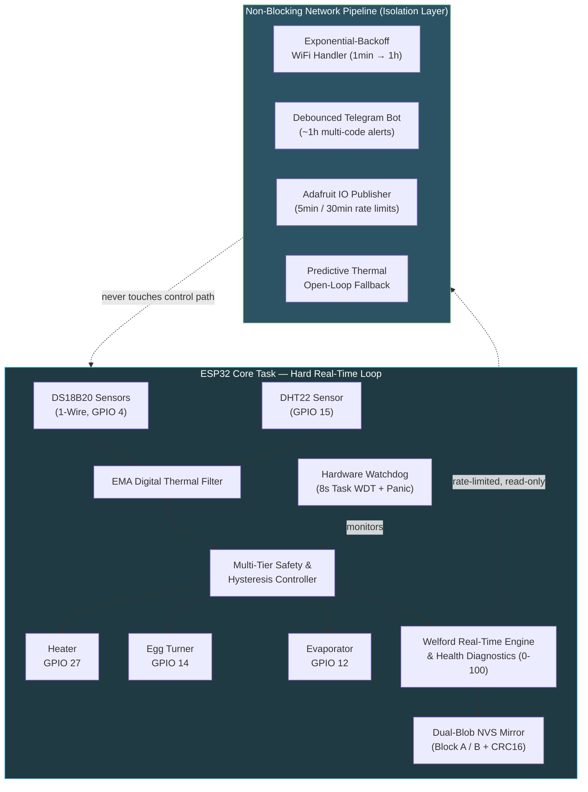
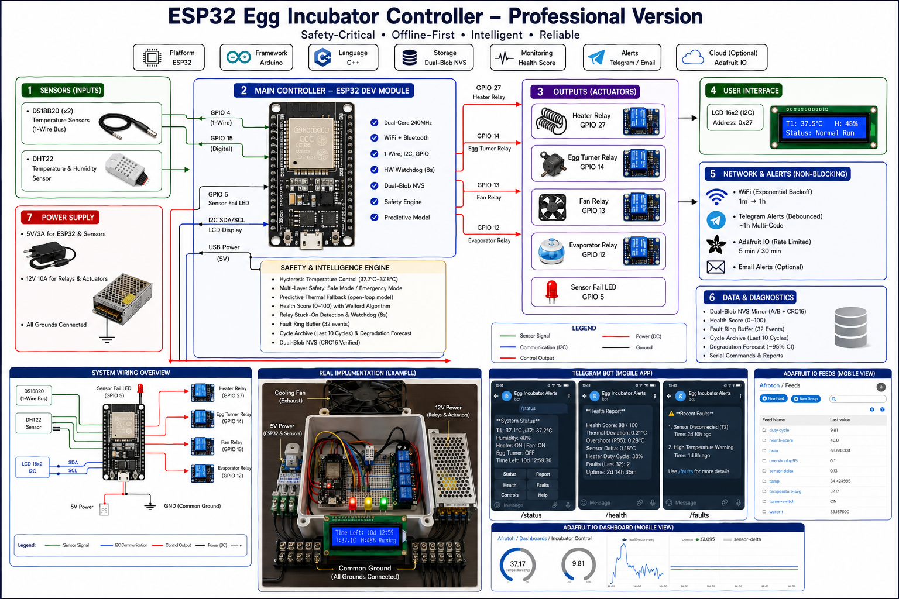
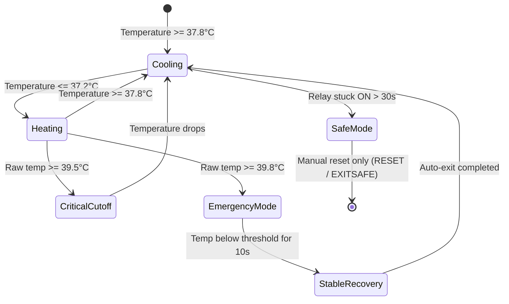
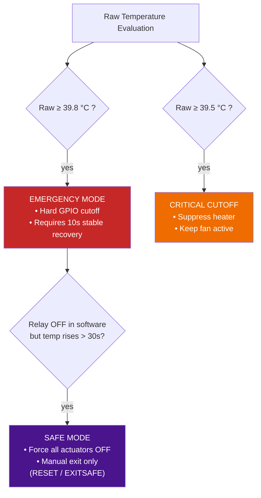
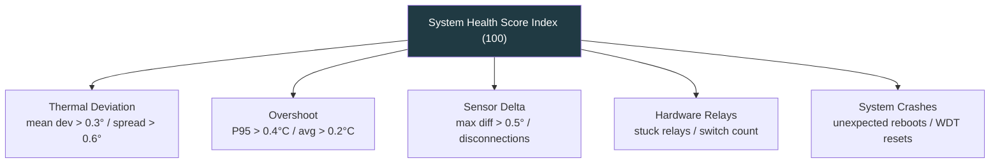
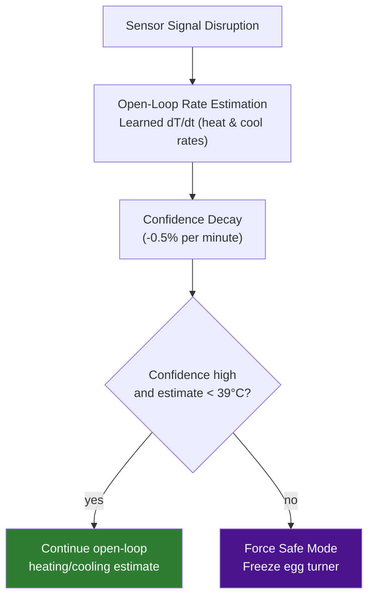
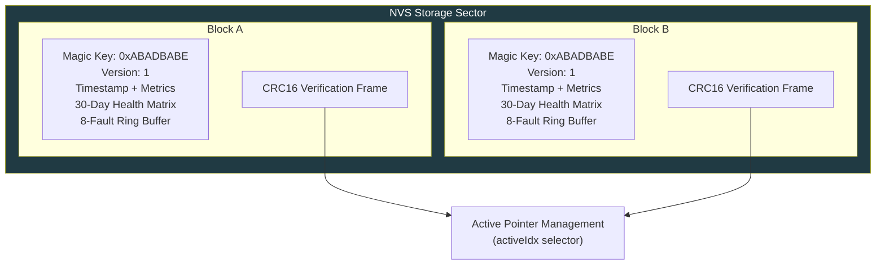
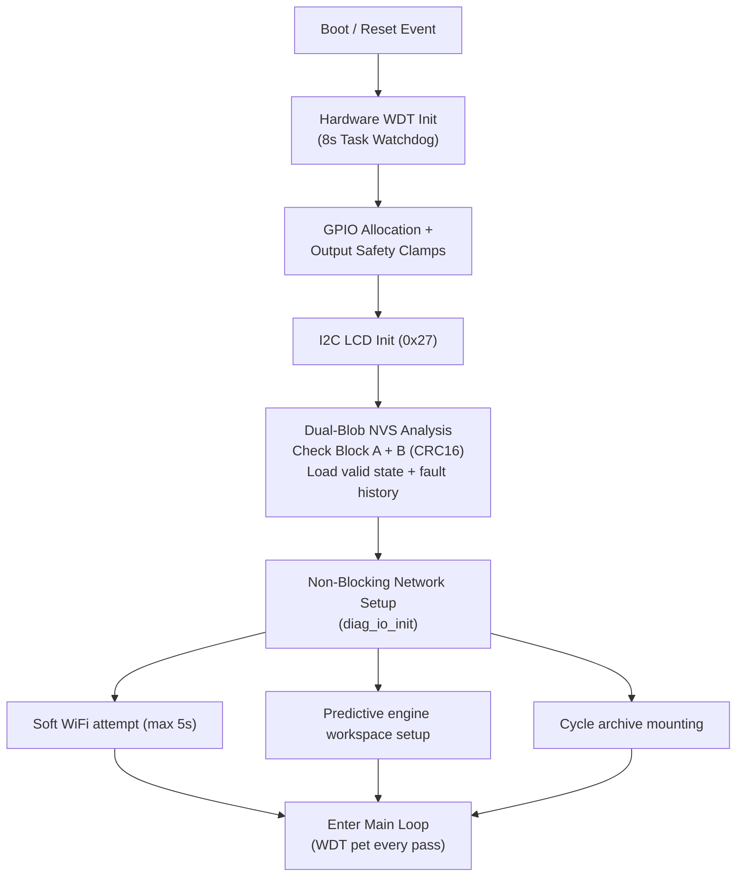
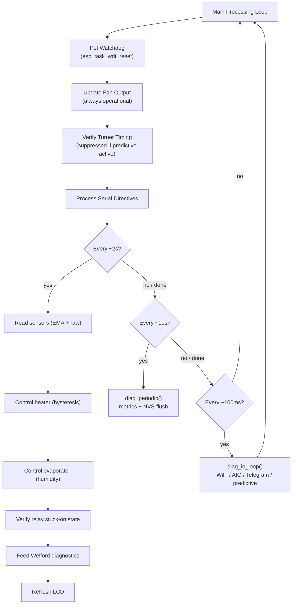

<div align="center">


# 🥚 ESP32 Egg Incubator Controller — Professional Version

**Safety-critical, offline-first firmware for egg incubation on ESP32 (Arduino framework).**
Hysteresis temperature control · multi-layer safety modes · predictive thermal fallback · dual-blob diagnostics · cycle learning · optional cloud/Telegram alerts.

[](https://www.espressif.com/)
[](https://www.arduino.cc/)
[](https://isocpp.org/)
[](LICENSE)
[]()

</div>

---

## 📑 Table of Contents

- [Introduction](#-introduction)
- [System Architecture](#-system-architecture)
- [Features](#-features)
- [Hardware & Pin Mapping](#-hardware--pin-mapping)
- [Firmware Algorithms](#-firmware-algorithms)
  - [Hysteresis Temperature Control](#1-hysteresis-temperature-control)
  - [Multi-Layer Safety Engine](#2-multi-layer-safety-engine)
  - [Health Score Engine](#3-health-score-engine-welford)
  - [Predictive Thermal Fallback](#4-predictive-thermal-fallback)
  - [Dual-Blob NVS Storage](#5-dual-blob-nvs-storage)
  - [Cycle Archive & Degradation Forecast](#6-cycle-archive--degradation-forecast)
- [System Sequences](#-system-sequences)
- [Installation & Setup](#-installation--setup)
- [Usage & Serial Commands](#-usage--serial-commands)
- [Software Architecture (Files)](#-software-architecture-files)
- [Customization](#-customization)
- [Important Notes & Warnings](#-important-notes--warnings)
- [Testing](#-testing)
- [Contributing](#-contributing)
- [License](#-license)
- [Acknowledgments](#-acknowledgments)
- [Contact & Support](#-contact--support)

---

## 📖 Introduction

An **egg incubator** must hold temperature near **37.7 °C** for days, turn eggs on a schedule, and manage humidity — while surviving sensor failures, power glitches, and operator mistakes.

This project is a **professional ESP32 controller** built with safety-critical and reliability-engineering practices:

| Problem                     | How this firmware addresses it                                                                  |
| ---------------------------- | ------------------------------------------------------------------------------------------------ |
| Overheating kills embryos    | Hard emergency cutoff at **39.8 °C**, critical cutoff at **39.5 °C**, deterministic hysteresis    |
| Sensor loss                  | **Predictive thermal model** estimates temperature, then forces **Safe Mode** if confidence decays |
| Silent hardware faults       | **Relay stuck-on detection**, 32-slot fault ring buffer, weighted health score                    |
| Lost history after reboot    | **Dual-blob NVS storage** with **CRC16** integrity checks                                         |
| Long-term degradation        | **Cycle archive** (last 10 cycles) + linear-regression **FORECAST** with ~95% confidence interval |
| Remote monitoring            | Optional **Adafruit IO**, debounced **Telegram** alerts, offline-first design                     |

**Design principle:** *the network is optional*. Control, safety, and diagnostics always run offline, on-device, in real time. Cloud and messaging never block the heater loop or the watchdog.

**Version:** v2.0.1 (production-oriented release) · **Main sketch:** `Memory10_2_4.ino`

---

## 🏗️ System Architecture

The system separates the **thermal control / biological-safety loop** (hard real-time, always running) from **communication and cloud protocols** (best-effort, fully non-blocking).



> Communication is strictly **observational and publish-only** — nothing arriving from the network can alter heater, turner, or safety-mode decisions.

---

## ✨ Features

### ⚙️ Core control

- **Heater** — hysteresis around `TEMP_TARGET` (37.7 °C): ON ≤ 37.2 °C, OFF ≥ 37.8 °C
- **Turner** — timed cycle (default 60 s OFF / 15 s ON); **frozen** while predictive mode is active
- **Fan** — always ON in normal and safety modes
- **Evaporator** — humidity-based control (≈45–55%); timed safe cycle if the DHT sensor is lost
- **EMA temperature smoothing** on the control path; **raw** (unfiltered) temperature used for all emergency decisions, so there is zero smoothing delay on cutoffs

### 🚨 Safety

- **Safe Mode** — sensors failed or a relay is stuck; heaters forced OFF; exit only via `RESET` / `EXITSAFE`
- **Emergency Mode** — raw temp ≥ **39.8 °C**; requires ~**10 s** stable below the exit threshold before auto-exit
- **Relay stuck-on protection** — heater commanded OFF in software but temperature keeps rising for > 30 s → forced Safe Mode
- **Watchdog (WDT)** — 8 s hardware task watchdog with panic reboot; fed every pass of `loop()` and during any short blocking wait
- **GPIO absolute cutoff** — actuators are physically driven to their safe state the instant a safety mode is entered

### 📊 Diagnostics & intelligence

- **Health Score** (0–100) — weighted penalty matrix across thermal deviation, overshoot, sensor delta, relay behavior, and crash history
- **Welford online algorithm** for streaming mean/variance with no dynamically-allocated arrays
- **Fault ring buffer** (32 events) with 4 severity levels (INFO / WARNING / CRITICAL / EMERGENCY)
- **Predictive model** — adaptively-learned heat/cool rates (°C/min), confidence decay over time, output clamped to a physically-plausible 20–42 °C band; will not fight an active Emergency Mode
- **Cycle archive** — last **10** completed incubation cycles stored in NVS, each with health/duty/overshoot
- **Degradation forecast** — linear regression over archived cycles projects when health will cross 70, with an approximate 95% confidence interval

### 📡 Monitoring & alerts

- Serial commands: `REPORT`, `STATUS`, `HEALTH`, `DIAG`, `FAULTS`, `FORECAST`, …
- **Telegram** — multi-code debounce (~1 h), sanitized text payloads, daily health summary, remote command handling
- **Adafruit IO** — rate-limited feeds (health/temperature every ~5 min; overshoot/delta/duty every ~30 min)
- All network I/O is **non-blocking** and millis()-driven — no `delay()` on the control path

### 🛡️ Reliability

- **Dual-blob NVS** storage (mirrored blocks A/B) with **CRC16** integrity verification and an active-pointer selector, so a power loss mid-write never corrupts the saved state
- **WiFi exponential backoff** (1 min → up to 1 h); the incubator keeps running fully offline if WiFi is unavailable
- No `String` objects on hot/critical paths — static buffers only, to avoid heap fragmentation over multi-week runs
- Core-dump flags in `build_opt.h` for post-crash forensic analysis

---

## 🔌 Hardware & Pin Mapping

| Component               | GPIO     | Signal Type      | Function |
| ------------------------ | -------- | ----------------- | -------- |
| DS18B20 (1-Wire bus)     | **4**    | Digital (1-Wire)  | Primary redundant temperature bus, EMA-filtered, 4.7 kΩ pull-up |
| DHT22                    | **15**   | Digital           | Humidity sensing + backup temperature reading |
| Heater relay             | **27**   | Digital output    | Heating element, deterministic hysteresis control |
| Egg turner motor         | **14**   | Digital output    | Turning cycle (60 s off / 15 s on) |
| Fan (circulation)        | **13**   | Digital output    | Always-on thermal circulation |
| Evaporator relay         | **12**   | Digital output    | Humidity control (target 45–55%) |
| Sensor-fail LED          | **5**    | Digital output    | Lights immediately if the DS18B20 bus fails |
| LCD 16×2                 | SDA/SCL  | I2C (`0x27`)      | Live operating status and diagnostics |

**Wiring notes**

- Use opto-coupled relays for the heater / turner / fan / evaporator loads.
- DS18B20 data line needs a 4.7 kΩ pull-up to 3.3 V.
- Confirm your LCD's I2C address — `0x27` is common, but some modules use `0x3F`.

---
---

## 📸 System Implementation & Monitoring

### Complete Hardware, Control, and Remote Monitoring Overview

The following figure presents the complete ESP32 Egg Incubator Controller implementation, including the physical control hardware, independent power distribution, common-ground architecture, sensors, relay-controlled actuators, local LCD interface, status/alarm indicators, cooling fan, and remote monitoring interfaces.

<div align="center">



</div>

**Figure — Complete system implementation and monitoring architecture.**

The controller operates with separate power domains for the low-voltage control electronics and relay/actuator loads, while maintaining a common ground reference. Local control and safety functions remain operational independently of network connectivity, with Telegram and Adafruit IO providing remote monitoring and diagnostic visibility.

---
## ⚙️ Firmware Algorithms

### 1. Hysteresis Temperature Control

```
T_target = 37.7 °C     T_low = 37.2 °C     T_high = 37.8 °C
```

The heater turns **ON** the instant the filtered temperature drops to ≤ 37.2 °C, and **OFF** at ≥ 37.8 °C. All emergency-cutoff decisions use the **raw**, unfiltered reading — never the EMA-smoothed value — so there is no added latency before a safety cutoff.



### 2. Multi-Layer Safety Engine



- **Critical Cutoff (39.5 °C):** heater signal suppressed immediately; the fan keeps running.
- **Emergency Mode (39.8 °C):** actuators are hard-cut; the system requires at least 10 s of stable temperature below the exit threshold before it is allowed to auto-exit.
- **Safe Mode:** entered on sensor-bus loss or a relay stuck-on condition lasting more than 30 s. This state is **sticky by design** — it never clears itself, only `RESET` / `EXITSAFE` can exit it.
- **Watchdog:** an 8 s hardware WDT reboots the MCU if the main loop ever stalls.

### 3. Health Score Engine (Welford)

Streaming mean/variance is computed with **Welford's online algorithm**, avoiding dynamically-allocated sample buffers:

```
x̄ₙ = x̄ₙ₋₁ + (xₙ − x̄ₙ₋₁) / n
M₂,ₙ = M₂,ₙ₋₁ + (xₙ − x̄ₙ₋₁)(xₙ − x̄ₙ)
σ² = M₂,ₙ / (n − 1)
```

The overall Health Score is `100 − Σ penalties`, distributed across five weighted categories:



### 4. Predictive Thermal Fallback



When the temperature sensors fail, the firmware switches to an **open-loop thermal estimate** derived from previously-learned heating/cooling rates. Confidence decays over time; if it drops below the safety floor — or the estimate itself exceeds 39 °C — the system forces Safe Mode and freezes the egg turner rather than trusting a stale guess.

### 5. Dual-Blob NVS Storage



Every persisted write alternates between Block A and Block B and is verified with CRC16 before it becomes "active." A power loss mid-write can never corrupt both copies at once.

### 6. Cycle Archive & Degradation Forecast

The last **10** completed incubation cycles (health, average temperature, duty cycle, overshoot) are archived in NVS. A simple linear regression against cycle index projects when the health trend will cross 70:

```
y = β₀ + β₁x        CI = ± 1.96 · σ_residual / |β₁|
```

If the projected slope is not meaningfully negative, `FORECAST` reports no significant degradation trend instead of a false projection.

---

## 🔄 System Sequences

### Boot sequence



### Main loop sequence



Control and safety decisions never wait on the network layer.

---

## 🚀 Installation & Setup

### Prerequisites

- **Board:** ESP32 Dev Module (or compatible)
- **IDE:** Arduino IDE 2.x **or** PlatformIO
- **Libraries** (Library Manager / PlatformIO):

| Library              | Typical source                    |
| --------------------- | ---------------------------------- |
| DHT sensor library    | Adafruit                           |
| OneWire               | Paul Stoffregen                    |
| DallasTemperature     | Miles Burton                       |
| LiquidCrystal_I2C     | common forks (match your LCD)      |
| EMailSender           | xreef (only if you enable email)   |

Built-in: `WiFi`, `HTTPClient`, `Preferences`, `esp_task_wdt`, `Wire`.

### Steps

1. **Clone / copy** the project into a single Arduino sketch folder. Keep **one** main `.ino` only (`Memory10_2_4.ino`) — do not mix older sketch versions in the same folder.
2. **Secrets**
   ```bash
   cp secrets.h.example secrets.h
   ```
   Edit `secrets.h` with your WiFi, Adafruit IO, and Telegram values. **Never commit `secrets.h`** — add it to `.gitignore`.
3. **Wire the hardware** according to the pin table above.
4. **Install the libraries** listed above.
5. **Board settings:** ESP32 Dev Module, serial monitor at **115200**.
6. **Upload**, then open the Serial Monitor.
7. Optional: keep `build_opt.h` in the sketch folder so the toolchain applies the core-dump build flags.

---

## 💻 Usage & Serial Commands

| Command      | Description                                                       |
| ------------- | ------------------------------------------------------------------ |
| `STATUS`      | Live status: temperatures, heater/turner state, Safe/Emergency, cycle |
| `REPORT`      | Full reliability report (health, thermal, faults, degradation)     |
| `HEALTH`      | Short health summary line                                          |
| `DIAG`        | Internal diagnostics counters                                      |
| `FAULTS`      | Last fault-ring events                                             |
| `FORECAST`    | Project cycles until health ≈ 70 (needs ≥ 3 archived cycles)       |
| `RESET`       | Reset cycle timer; clear Safe and Emergency states                 |
| `EXITSAFE`    | Exit Safe Mode only                                                 |
| `EXITEMG`     | Exit Emergency Mode only                                            |
| `CLEARDIAG`   | Erase diagnostics NVS — then type `CONFIRM` within 5 s              |
| `RESETDHT`    | Re-`begin()` the humidity sensor without heap churn                |

Example boot log:

```text
Boot #3
System Starting...
✅ System Ready!
📡 diag_io_init: attempting WiFi (max 5 s)...
🧠 Predictive model ready
📚 Cycle archive loaded: 0 records
T1: 37.51 | T2: 37.48 | Avg: 37.5 | ...
```

---

## 🗂️ Software Architecture (Files)

| File                            | Role                                                                             |
| -------------------------------- | --------------------------------------------------------------------------------- |
| `Memory10_2_4.ino`               | Main loop, sensors, heater/turner/fan/evaporator, Safe/Emergency, serial commands |
| `diagnostics.h` / `diagnostics.cpp` (referenced) | Health score, Welford engine, dual-blob storage, fault ring, degradation tracking |
| `diag_io.h` / `diag_io.cpp`      | Non-blocking WiFi, Adafruit IO publishing, ties together Telegram + predictive + archive |
| `predictive_model.h` / `.cpp`    | Open-loop thermal estimate activated on sensor loss                              |
| `cycle_archive.h` / `.cpp`       | Last-10-cycle archive, comparison, `FORECAST` + confidence interval               |
| `telegram_alerts.h` / `.cpp`     | Debounced Telegram alerts, remote command handling, reset/fault reports          |
| `diag_io.h` (I/O layer)          | Public API for the non-blocking cloud/telegram/predictive pipeline               |
| `secrets.h` / `secrets.h.example`| Credentials (kept local only, never committed)                                   |
| `build_opt.h`                    | Core-dump compiler flags for post-crash analysis                                 |

**Shared structs** (`Actuator`, `HumiditySensor`, `DSTemperatureSensor`, `FaultRec`) live in `diagnostics.h` only.

**Actuator index map** (kept consistent with `REPORT`):

```text
0 = Fan, 1 = Turner, 2 = Heater, 3 = Evaporator
```

---

## 🔧 Customization

### Temperature thresholds

```cpp
#define TEMP_TARGET     37.7
#define TEMP_LOW        (TEMP_TARGET - 0.3)   // heater ON
#define TEMP_HIGH       (TEMP_TARGET + 0.1)   // heater OFF
#define TEMP_CRITICAL   39.5
#define TEMP_EMERGENCY  39.8
```

### Turner timing

```cpp
#define TURNER_OFF_TIME  60000   // ms
#define TURNER_ON_TIME   15000
```

### Health penalties & degradation (`diagnostics.h`)

```cpp
#define PENALTY_MEAN_DEV_HIGH   15.0f
// ... other PENALTY_* constants ...
#define DEGRADATION_THRESHOLD  (-0.5f)   // health points per day
```

### Adafruit IO feeds

Create feeds matching the names used in `diag_io.cpp` (`health-score`, `temperature-avg`, `overshoot-p95`, `sensor-delta`, `duty-cycle`) under your Adafruit IO account.

---

## ⚠️ Important Notes & Warnings

1. **Watchdog** — never add a long blocking `delay()` on a control path; existing waits call `esp_task_wdt_reset()`.
2. **Secrets** — only in `secrets.h`; never hardcode WiFi/tokens in `.cpp` files.
3. **Safe Mode does not auto-exit** on "stable readings" — this is by design; use `RESET` or `EXITSAFE`.
4. **Offline-first** — a missing WiFi connection never stops incubation control.
5. **One sketch folder** — multiple main `.ino` files in the same project folder cause link errors.
6. This firmware is **not a substitute** for proper incubator hardware, insulation, calibration, or biosecurity practice.

---

## 🧪 Testing

| Goal          | How                                                                                       |
| -------------- | ------------------------------------------------------------------------------------------ |
| Safe Mode      | Disconnect both DS18B20 sensors (or force invalid readings) → heaters OFF, LED on          |
| Emergency      | Raise the sensor reading to ≥ 39.8 °C → Emergency; cool and hold ≥ 10 s for auto-exit (or `EXITEMG`) |
| Relay stuck    | Simulate a high temperature with the heater software-OFF for > 30 s (outside Safe/Emergency) |
| Predictive     | Fail the DS sensors after rates were learned → predictive log appears; low confidence → Safe (if not already Emergency) |
| FORECAST       | Complete ≥ 3 full cycles (or inject lab archive data), then run `FORECAST`                 |
| CLEARDIAG      | `CLEARDIAG` then `CONFIRM` within 5 s; verify with `REPORT`                                 |
| Offline        | Use wrong WiFi credentials → control continues normally; only backoff messages appear      |

Recommended: a **24-hour soak test** with Serial logging and periodic `REPORT` / `HEALTH` checks.

---

## 🤝 Contributing

1. Fork / branch from the current v2.0.1 baseline.
2. Do **not** change heater hysteresis or Emergency thresholds without documenting the safety risk.
3. Prefer static buffers; avoid `String` and heap allocation on `loop` / `diag_sample` / `controlHeater`.
4. Keep the actuator index map (0–3) aligned with the diagnostics `REPORT` output.
5. Open a PR describing what changed, why, and how you tested it (Serial commands / hardware scenario).

---

## 📄 License

Released under the **MIT License** (or the license file included in the repository, if different). Use, modify, and distribute with attribution. **No warranty** — use at your own risk for biological processes.

---

## 🙏 Acknowledgments

- Espressif ESP32 Arduino core and WDT / NVS APIs
- Adafruit DHT library
- OneWire / DallasTemperature communities
- LiquidCrystal_I2C maintainers
- Everyone iterating on reliability patterns (dual-blob storage, fault rings, offline-first IoT)

---

## 📬 Contact & Support

- Open an **issue** on the repository for bugs and feature requests.
- For private deployment questions, use the contact channel provided by the project maintainer.
- Report credential leaks or unsafe defaults privately when possible.

---

<div align="center">

**Keep the network optional. Keep the eggs safe.**

</div>
