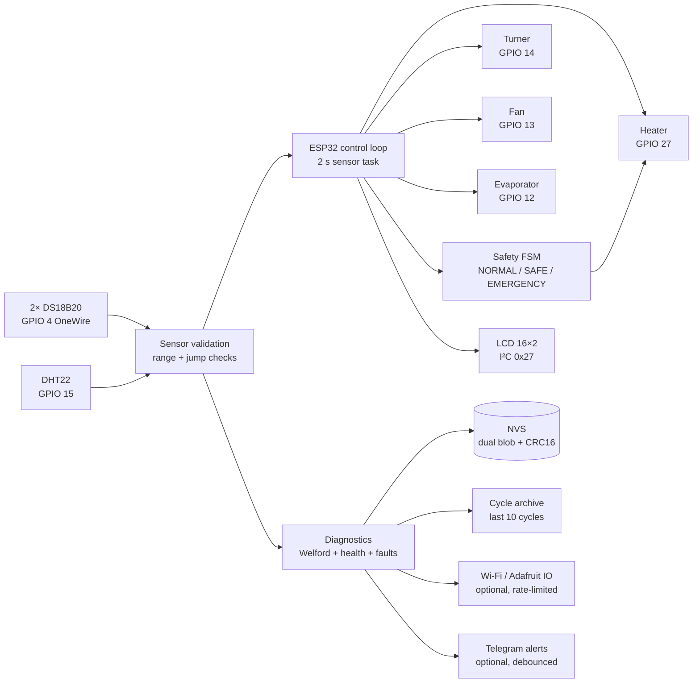
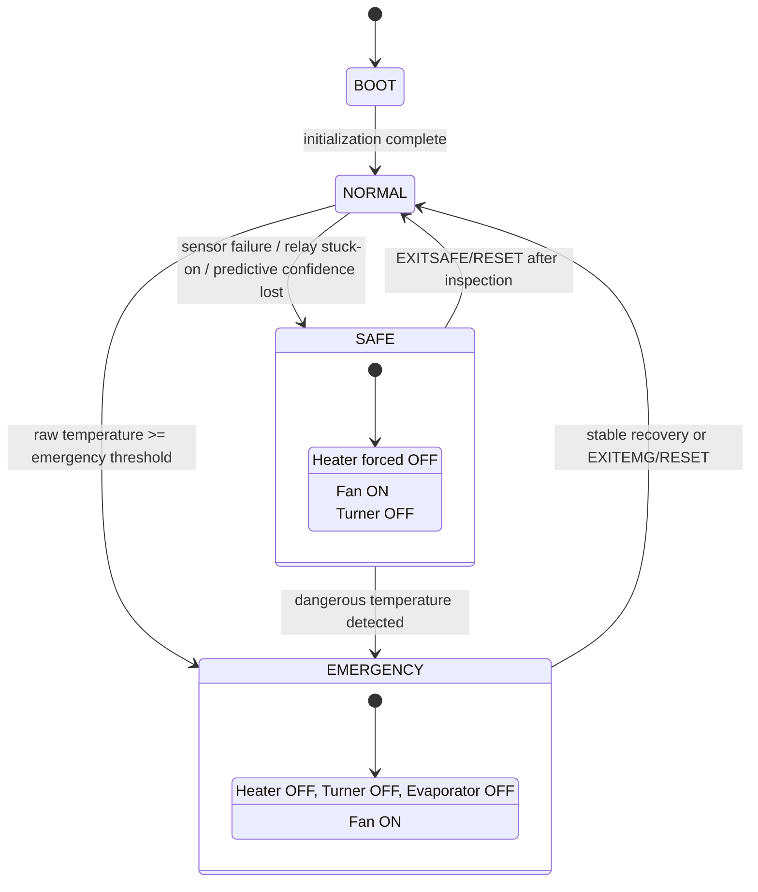
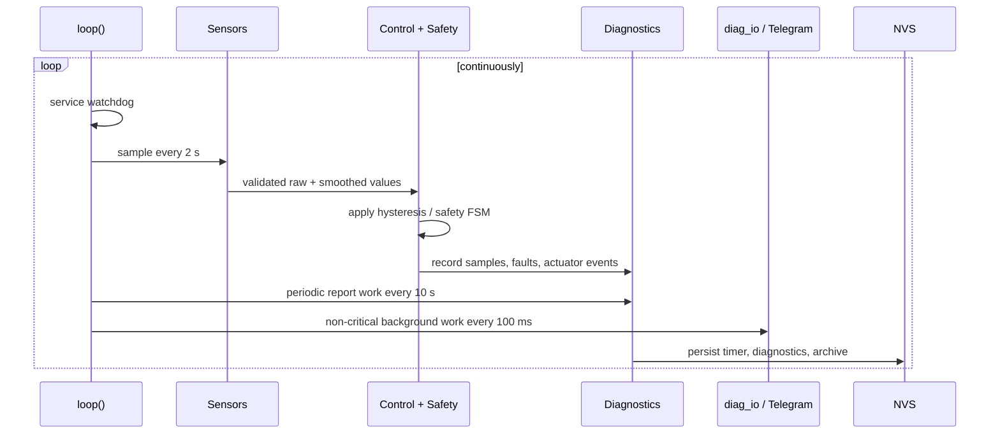

# 🥚 ESP32 Egg Incubator Controller

### Safety-first • Offline-first • Evidence-driven ESP32 firmware for biological incubation

[](https://www.espressif.com/)
[](https://www.arduino.cc/)
[](https://isocpp.org/)
[](LICENSE)
[](docs/ARCHITECTURE.md)

> **A complete embedded-systems project—not just a temperature thermostat.**
> This repository combines closed-loop thermal control, fail-safe states, sensor
> validation, persistent diagnostics, predictive fallback, cycle learning,
> remote observability, hardware documentation, and operational evidence.

**Author:** Mustafa Fathy Abdeltawab Youssef  
**Firmware:** `v2.0.1`  
**Target:** ESP32 Dev Module / compatible ESP32 boards  
**Framework:** Arduino

> [!IMPORTANT]
> This is a prototype firmware project for engineering and educational use. It
> is **not** a certified medical, agricultural, life-support, or commercial
> incubation product. Reliable incubation still requires suitable insulation,
> calibrated sensors, electrical protection, ventilation, biosecurity, and
> supervised hardware testing.

---

## ✨ Why this project stands out

Most incubator controllers stop at `if (temperature < target) heaterOn()`. This
project treats incubation as a **long-running, failure-prone cyber-physical
system**:

- The control and safety path continues to operate when Wi-Fi is unavailable.
- Raw temperature is reserved for emergency decisions; an EMA-smoothed value is
  used for normal hysteresis control.
- Sensor loss does not immediately turn into an uncontrolled guess: the
  predictive model estimates temperature while its confidence decays, then
  escalates to Safe Mode when confidence is no longer trustworthy.
- Persistent diagnostics survive reboot using dual NVS blocks and CRC16.
- A health score, fault ring, reset statistics, cycle archive, trend analysis,
  and evidence folder make the system observable and reviewable.
- The design includes explicit behaviour for Safe Mode, Emergency Mode, relay
  faults, humidity-sensor loss, watchdog resets, and offline operation.

## 🧭 System at a glance



### Control-loop timing

| Task | Implemented behaviour |
|---|---|
| Watchdog servicing | First operation in `loop()` and around background operations |
| Sensor/control task | Every `2,000 ms` |
| Diagnostics periodic task | Every `10,000 ms` |
| Cloud/Telegram background task | Every `100 ms` |
| Telegram command polling | Every `3,000 ms` when Wi-Fi is connected |
| Cycle duration | `86,400 s` (24 hours) |

The main loop keeps sensing, safety, actuator control, and diagnostics separate
from best-effort network work. Network loss changes observability—not the
incubation control decision.

---

## 🧠 Engineering highlights

### 1. Temperature control with hysteresis

The runtime defaults loaded into `SystemConfig` are:

- Target: **37.7 °C**
- Heater ON threshold: **37.4 °C** (`target − 0.3`)
- Heater OFF threshold: **37.8 °C** (`target + 0.1`)
- Critical cutoff: **39.5 °C**
- Emergency entry: **39.8 °C**
- Emergency exit stability window: **10 s** below the configured high threshold

The heater decision uses `currentTemperature`, the EMA-smoothed value. Emergency
and critical checks use `rawTemperature`, reducing the risk that smoothing hides
a dangerous spike. The heater is also monitored for excessive runtime and
software-OFF/high-temperature relay-stuck behaviour.

### 2. Explicit safety state machine



| State | Heater | Turner | Fan | Evaporator | Purpose |
|---|---:|---:|---:|---:|---|
| `NORMAL` | Controlled | Timed | ON | Humidity-controlled | Regular incubation |
| `SAFE` | Forced OFF | OFF | ON | Safe timed fallback | Protect hardware/biological load after a fault |
| `EMERGENCY` | Forced OFF | OFF | ON | OFF | Remove heat and isolate outputs |

### 3. Sensor resilience

- Up to **2 DS18B20** devices share the OneWire bus.
- Temperature readings are checked for plausibility (`0–50 °C`) and jumps
  larger than `5 °C`.
- DS18B20 conversion handling has a `750 ms` timeout.
- The DHT22 is sampled for humidity and backup temperature.
- After **3** consecutive DHT failures, a sensor is bypassed for **60 s** before
  retrying; `RESETDHT` provides a manual reinitialization path.
- A dedicated sensor-failure LED is driven on GPIO **5** when all DS18B20 sensors
  are invalid.

### 4. Predictive thermal fallback

`predictive_model.cpp` is observation-only while sensors are healthy. It learns
heat/cool rates from recent valid readings, then estimates temperature when
sensor data is lost. The estimate is clamped to **20–42 °C** and confidence
starts at **100%**, decaying by **0.5 percentage points per minute** while the
model remains active. If confidence falls below **60%**, or the estimate rises
above **39 °C**, the model escalates to Safe Mode unless Emergency Mode is
already active.

The turner is frozen during predictive mode. When valid sensors recover, the
predictive state is cleared and confidence is reset.

### 5. Diagnostics as a reliability layer

The diagnostics module maintains:

- A **0–100 health score** built from thermal behaviour, overshoot, sensors,
  heater, software resets, and actuator behaviour.
- Welford online statistics for mean and variance without storing every sample.
- Temperature histogram and overshoot histogram data, including P95 helpers.
- Time-in-band measurements, sensor-to-sensor delta, duty cycle, heater cycles,
  switching counts, and runtime counters.
- A **32-entry fault ring** with info, warning, critical, and emergency levels.
- Detailed reset logs with reset reason, uptime, value, and fault code.
- A **30-day circular health/degradation history** with a configurable slope
  threshold (`-0.5`).
- Dual diagnostic NVS blobs with CRC16 validation for reboot resilience.

### 6. Cycle archive and forecast

At each completed 24-hour cycle, the firmware archives cycle number, health,
average temperature, duty cycle, overshoot, and completion timestamp. The
archive stores the last **10** records in NVS. `FORECAST` performs a linear
regression and reports an approximate projection toward health **70** when at
least **3** archived cycles are available.

### 7. Observability without compromising control

- Adafruit IO publishing is optional and rate-limited: fast feeds every **5 min**
  and slow feeds every **30 min**.
- Wi-Fi reconnect backoff starts at **1 min** and grows to a maximum of **1 hour**.
- Telegram alerts use debouncing and periodic monitoring controls.
- HTTP timeout is configured to **1,000 ms** in the cloud I/O module.
- `secrets.h` is intentionally excluded; only `secrets.h.example` belongs in a
  public checkout.

---

## 🔌 Hardware and pin mapping

| Component | GPIO / interface | Role |
|---|---:|---|
| DS18B20 ×2 | GPIO **4** | Primary temperature sensing on OneWire |
| DHT22 | GPIO **15** | Humidity + backup temperature |
| Fan | GPIO **13** | Circulation / cooling; forced ON in safety states |
| Turner | GPIO **14** | Egg-turning motor |
| Heater relay | GPIO **27** | Heating element control |
| Evaporator / humidifier | GPIO **12** | Humidity control |
| Sensor-failure LED | GPIO **5** | All DS18B20 sensors invalid |
| LCD 16×2 | I²C, address **0x27** | Local status display |

> **Electrical safety:** relay modules, heaters, motors, fuses, grounding,
> isolation, flyback protection, wire gauge, and mains work must be designed and
> verified by qualified practice. Never connect mains voltage directly to an
> ESP32 GPIO.

### Default operating parameters

| Parameter | Default |
|---|---:|
| Temperature target | 37.7 °C |
| Heater ON / OFF | 37.4 °C / 37.8 °C |
| Critical cutoff | 39.5 °C |
| Emergency cutoff | 39.8 °C |
| Turner OFF / ON interval | 60 s / 15 s |
| Maximum heater runtime warning | 30 s |
| Sensor sampling | 2 s |
| NVS timer save interval | 60 s |
| Humidity control band | ON below 45%; OFF above 55% |
| DHT retry interval after bypass | 60 s |
| Cycle duration | 24 h |
| Task WDT configuration | 30 s |

These are software defaults, not a substitute for calibration or species-
specific incubation protocols.

---

## 🛠️ Installation

### Requirements

- Arduino IDE 2.x (or Arduino IDE 1.8+)
- ESP32 board package
- ESP32 Dev Module or compatible board
- USB cable and a suitable regulated power supply

### Libraries

Install through Arduino Library Manager:

- DHT sensor library by Adafruit
- Adafruit Unified Sensor
- OneWire
- DallasTemperature
- LiquidCrystal I2C
- UniversalTelegramBot *(optional cloud alerting)*
- ArduinoJson *(dependency of UniversalTelegramBot)*

### Build and flash

1. Clone or download this repository.
2. Copy `secrets.h.example` to `secrets.h`.
3. Fill only the local credentials needed for Wi-Fi, Telegram, and Adafruit IO.
4. Open `ESP32_Incubator.ino` in Arduino IDE. Keep the sketch and folder names
   compatible with Arduino's `.ino` project rules.
5. Select **ESP32 Dev Module**, the correct port, and upload.
6. Open Serial Monitor at **115200 baud**.
7. Type `VERSION`, then `SHOW_CONFIG`, then `STATUS` to confirm startup.

> Never commit `secrets.h`, real tokens, passwords, or API keys. Cloud features
> are optional; the controller is intended to remain functional offline.

---

## 🖥️ Serial command reference

Commands are handled case-insensitively where implemented in the main sketch.

| Command | Function |
|---|---|
| `HELP` / `?` | Print the complete command list |
| `STATUS` | Live temperature, actuator, mode, cycle, and sensor validity |
| `REPORT` | Full reliability and diagnostic report |
| `HEALTH` | Short health summary |
| `DIAG` | Internal diagnostic counters and state |
| `FAULTS` | Print recent fault-ring events |
| `FORECAST` | Project health degradation; requires at least 3 archived cycles |
| `HEAP` | Free heap and minimum-ever free heap |
| `VERSION` | Firmware, chip model/revision, and CPU frequency |
| `SHOW_CONFIG` | Print dynamic NVS-backed thresholds and timing |
| `SET_TEMP <°C>` | Set target; accepted range 30–42 °C |
| `SET_CRITICAL <°C>` | Set critical cutoff; accepted range 38–45 °C |
| `SET_EMERGENCY <°C>` | Set emergency cutoff; must be above critical and 38–45 °C |
| `SET_TURNER_ON <s>` | Set turner ON time; accepted range 5–60 s |
| `SET_TURNER_OFF <s>` | Set turner OFF time; accepted range 30–600 s |
| `RESET` | Reset 24-hour timer and clear Safe/Emergency state |
| `EXITSAFE` | Clear Safe Mode only |
| `EXITEMG` | Clear Emergency Mode only |
| `RESETDHT` | Reinitialize humidity sensor(s) |
| `CLEARDIAG` | Request diagnostic erase; requires `CONFIRM` within 5 s |
| `MONITORON` | Enable periodic Telegram monitoring |
| `MONITOROFF` | Disable periodic Telegram monitoring |
| `TESTTG` | Send a test Telegram fault notification |
| `PUBLISH` | Publish all configured cloud feeds immediately |

> Safety note: commands that clear a safety state should only be used after the
> physical cause has been inspected and the sensors/actuators are known to be
> safe.

---

## 🗂️ Software architecture

| Module | Responsibility |
|---|---|
| `ESP32_Incubator.ino` | Main loop, sensors, actuator control, FSM, timer, LCD, Serial |
| `diagnostics.cpp/.h` | Health score, Welford statistics, NVS persistence, faults, reports |
| `predictive_model.cpp/.h` | Sensor-loss thermal estimate and confidence management |
| `cycle_archive.cpp/.h` | Last-10-cycle archive, comparison, and forecast |
| `diag_io.cpp/.h` | Wi-Fi reconnect, Adafruit IO, JSON payloads, module orchestration |
| `telegram_alerts.cpp/.h` | Debounced alerts, monitoring, reset reports, Telegram commands |
| `build_opt.h` | ESP32 ELF core-dump build flags |
| `secrets.h.example` | Public credential template; copy locally to `secrets.h` |



---

## 🧪 Testing and evidence

The repository includes an engineering test guide and operational evidence rather
than claiming that a formal certification test suite has been completed.

### Recommended hardware test matrix

| Scenario | Expected result |
|---|---|
| Normal temperature regulation | Heater follows hysteresis; fan remains ON |
| Raw temperature ≥ critical | Heater is forced OFF |
| Raw temperature ≥ emergency | Emergency Mode; heater/turner/evaporator OFF; fan ON |
| Sensor disconnect | Validation detects loss; predictive path engages; escalation is safe |
| Predictive confidence decay | Confidence decreases; Safe Mode is entered below the trust limit |
| Relay stuck-on simulation | 30 s high-temperature condition leads to Safe Mode |
| DHT failure | Three failures trigger bypass; retry occurs after 60 s |
| Wi-Fi unavailable | Control loop and safety continue offline |
| Watchdog stress | WDT is serviced; reset reason is recorded if a reset occurs |
| NVS reboot recovery | Timer, safety state, diagnostics, and archive recover correctly |
| `CLEARDIAG` | Data is erased only after the 5-second `CONFIRM` handshake |
| `FORECAST` | Insufficient-data message below 3 cycles; forecast after enough data |

### Included evidence

- Telegram diagnostic screenshots: `docs/evidence/telegram/`
- Adafruit IO dashboards and feed screenshots: `docs/evidence/adafruit/`
- Export samples: `docs/evidence/samples/`
  - `temperature-avg_sample.csv`
  - `health-score_sample.csv`
  - `duty-cycle_sample.csv`

The evidence is from a working breadboard/prototype context and should be read
as operational demonstration—not certification or proof of unattended
commercial production reliability.

---

## 🖼️ Documentation assets

### Engineering diagrams — [`docs/diagrams/`](docs/diagrams/)

- [`01_system_block_diagram.svg`](docs/diagrams/01_system_block_diagram.svg)
- [`01b_system_block_diagram_v2.svg`](docs/diagrams/01b_system_block_diagram_v2.svg)
- [`02_circuit_schematic.svg`](docs/diagrams/02_circuit_schematic.svg)
- [`02b_circuit_schematic_v2.svg`](docs/diagrams/02b_circuit_schematic_v2.svg)
- [`03_wiring_diagram.svg`](docs/diagrams/03_wiring_diagram.svg)
- [`04_pcb_layout_guide.svg`](docs/diagrams/04_pcb_layout_guide.svg)
- [`05_enclosure_design.svg`](docs/diagrams/05_enclosure_design.svg)
- [`06_bom.svg`](docs/diagrams/06_bom.svg)
- [`07_testing_guide.svg`](docs/diagrams/07_testing_guide.svg)
- [`08_control_flowchart.svg`](docs/diagrams/08_control_flowchart.svg)
- [`09_temperature_profile.svg`](docs/diagrams/09_temperature_profile.svg)
- [`10_health_score_over_time.svg`](docs/diagrams/10_health_score_over_time.svg)

See [`docs/diagrams/README.md`](docs/diagrams/README.md) for usage notes.

### Prototype and operational photos

- [`01_prototype_overview_running.jpg`](docs/photos/01_prototype_overview_running.jpg)
- [`02_lcd_relays_running.jpg`](docs/photos/02_lcd_relays_running.jpg)
- [`03_lcd_humidity_control.jpg`](docs/photos/03_lcd_humidity_control.jpg)
- [`04_full_assembly_cardboard_enclosure.jpg`](docs/photos/04_full_assembly_cardboard_enclosure.jpg)
- [`05_esp32_breadboard_closeup.jpg`](docs/photos/05_esp32_breadboard_closeup.jpg)

---

## 📁 Repository map

```text
.
├── ESP32_Incubator.ino
├── diagnostics.cpp / diagnostics.h
├── diag_io.cpp / diag_io.h
├── predictive_model.cpp / predictive_model.h
├── cycle_archive.cpp / cycle_archive.h
├── telegram_alerts.cpp / telegram_alerts.h
├── build_opt.h
├── secrets.h.example
├── INSTALL.txt
├── IMPROVEMENTS.md
├── CONTRIBUTING.md
├── LICENSE
└── docs/
    ├── ARCHITECTURE.md
    ├── diagrams/        # system, circuit, wiring, enclosure, BOM, tests
    └── evidence/        # Telegram, Adafruit IO, CSV samples
```

The public repository tree currently contains no committed `secrets.h`, no
committed email reporter module, and no automated unit-test directory. Those
limitations are intentionally not hidden: hardware tests and reproducible
validation should be expanded as the project moves beyond prototype status.

---

## 🔐 Safety, security, and design boundaries

- Keep the control loop independent of Wi-Fi, Telegram, and Adafruit IO.
- Never commit credentials; use `secrets.h.example` as the public template.
- Treat the ESP32 GPIO outputs as low-voltage control signals only.
- Validate temperature sensors and relay hardware independently of software.
- Review all threshold changes on real hardware before incubation.
- Do not interpret a high health score as a biological guarantee.
- Back up and inspect NVS behaviour after firmware upgrades.
- Keep network calls short, rate-limited, and outside safety decisions.

## 🤝 Contributing

Please read [`CONTRIBUTING.md`](CONTRIBUTING.md). Safety-related changes should
include the risk, test setup, observed behaviour, and rollback considerations.
Keep pull requests focused and never include real credentials.

## 📜 License

Released under the [MIT License](LICENSE).

## 🙏 Acknowledgments

Built with the ESP32 Arduino ecosystem and the Adafruit, OneWire,
DallasTemperature, LiquidCrystal I2C, UniversalTelegramBot, and ArduinoJson
libraries.

## 🔗 Project links

- [Repository](https://github.com/MostafaFathi-afrotoh/-ESP32-Egg-Incubator)
- [Issues and discussions](https://github.com/MostafaFathi-afrotoh/-ESP32-Egg-Incubator/issues)
- [ESP32 by Espressif](https://www.espressif.com/)
- [Arduino](https://www.arduino.cc/)
